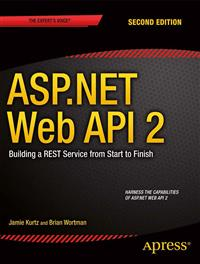

# Apress Source Code

This repository accompanies [*ASP.NET Web API 2: Building a REST Service from Start to Finish*](http://www.apress.com/9781484201107) by Jamie Kurtz and Brian Wortman (Apress, 2014).

Download the files as a zip using the green button, or clone the repository to your machine using Git.

## Releases

Release v1.0 corresponds to the code in the published book, without corrections or updates.

## Contributions

See the file Contributing.md for more information on how you can contribute to this repository.
